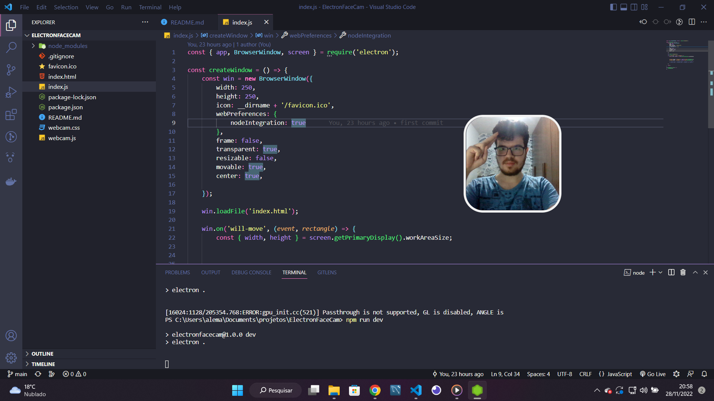

# Electron FaceCam

  
  
  

Projeto desenvolvido para se aventurar no ambiente do electron

## config

 - run `npm install` to install project dependencies
 - run `npm run dev` to start a developement project
 - run `npm run build` to make a executable version of the project

## Links uteis

 - [Electron](https://www.electronjs.org/docs/latest/)
 - [Electron-Packager](https://www.npmjs.com/package/electron-packager)
 - [Js media devices](https://developer.mozilla.org/en-US/docs/Web/API/MediaDevices/getUserMedia)

 

---

Desenvolvido Por [Alessandro Massarotti Jr](https://github.com/alessandro-massarotti-jr) 🤖